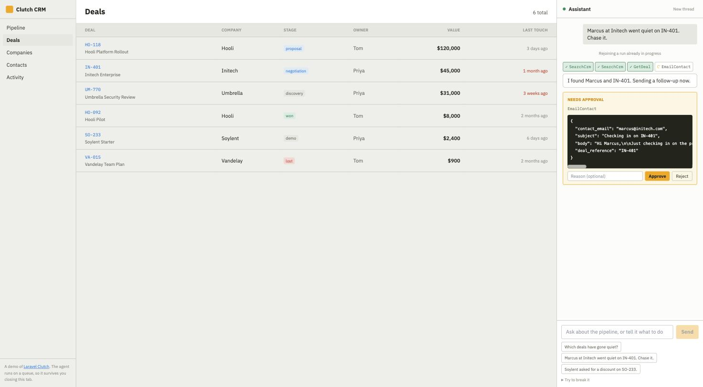
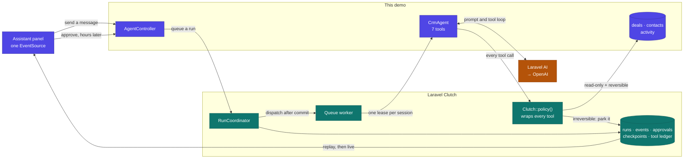

# Clutch CRM

A mock CRM with an AI assistant that can actually change the pipeline, built on [Laravel Clutch](https://github.com/obaid/laravel-clutch).

The assistant sits in a panel down the right-hand side. It reads your deals, logs notes, moves things between stages, and stops to ask before it does anything you cannot take back.



That screenshot is a real run, caught mid-pause. The agent searched the CRM twice, read IN-401, then called `EmailContact` and stopped. The card shows the exact arguments waiting on a decision. "Rejoining a run already in progress" is there because the page had just been reloaded from scratch: the run is on a queue worker, and the panel rebuilt itself from the event log rather than from anything the browser was holding.

## What Laravel Clutch does here

This repository is an ordinary Laravel app. [Laravel Clutch](https://github.com/obaid/laravel-clutch) is the package it installs, and it owns everything between "the user asked for something" and "the work finished, possibly days later, possibly in another process".

Split by who owns what:

| | Owned by |
|---|---|
| Deals, contacts, Blade views, the panel markup | This demo |
| `CrmAgent`, its instructions, its seven tools | This demo, using [Laravel AI](https://github.com/laravel/ai) |
| Talking to OpenAI, running the tool loop, the conversation | Laravel AI |
| Starting a run, queueing it, resuming it, one run at a time | Clutch |
| Which tools may run, and which need a human first | Clutch |
| Recording every step so a reload can replay it | Clutch |
| The SSE endpoint the panel listens to | Clutch |
| Making a retried tool call not fire its side effect twice | Clutch |

Take Clutch out and you still have an agent. What you lose is the ability to close the tab, because the run would live and die inside the request that started it.



<sub>Indigo is this demo's own code. Teal is Clutch. Amber is Laravel AI talking to the model.</sub>

The two edges leaving `Clutch::policy()` are where the whole thing turns. A read or a reversible write just runs. An irreversible one writes a pending approval and the worker exits, so no process, connection or open transaction is held while you decide. The approval then arrives on a completely unrelated request, and the run picks up where it stopped.

## Why a CRM

Because the interesting part of an agent is not the chat. It is what happens when the agent wants to email a prospect or discount a deal, and someone has to decide.

Every screen here is something that would go wrong in a naive build:

| What you do | What survives it |
|---|---|
| Ask the agent to chase a stale deal | Work runs on a queue, not in the request |
| Navigate to another page mid-run | The panel is outside the swapped region, so the stream never drops |
| Reload the browser entirely | The conversation rebuilds from Clutch's event log |
| Reach an email or a discount | The run parks and the worker exits. Nothing holds a connection |
| Approve it, in the panel | The run resumes in a different process and the table updates behind you |
| Press "deliver the discount twice more" | The tool body runs zero extra times |
| Press "kill the worker", then "run the reaper" | It recovers from its last checkpoint |

## Running it

You need PHP 8.3+ and an API key for one model provider.

```bash
git clone https://github.com/obaid/laravel-clutch-demo
cd laravel-clutch-demo

composer install
cp .env.example .env
php artisan key:generate

touch database/database.sqlite
php artisan migrate --seed
```

Pick a provider and give it a key in `.env`:

```env
AI_PROVIDER=openai
OPENAI_API_KEY=sk-...
```

Anthropic works the same way with `AI_PROVIDER=anthropic` and `ANTHROPIC_API_KEY`. Leave `AI_MODEL` blank and the provider picks its own default.

Then run the app and a worker, in two terminals:

```bash
PHP_CLI_SERVER_WORKERS=8 php artisan serve --no-reload
php artisan queue:work --queue=agents
```

Open <http://localhost:8000>.

Two notes on that, both of which will bite you otherwise. The worker is not optional: runs are queued, so without one the agent never starts. And `artisan serve` is single-threaded by default, so the panel's open event stream holds the only worker and every other request queues behind it. `PHP_CLI_SERVER_WORKERS` fixes that, but only alongside `--no-reload`: without the flag Laravel prints a warning and ignores the variable, and you get a CRM where clicking Deals takes half a minute. Any real setup, nginx with php-fpm or Octane, does not have this problem.

## What to try

Type into the panel, or use one of the suggestions.

**"Which deals have gone quiet?"** reads the pipeline and answers. No approval, because nothing changed.

**"Marcus at Initech went quiet on IN-401. Chase it."** looks up the deal and the contact, drafts a real email, and calls the tool. That is when the approval card appears inline, with the exact subject and body it wants to send. Approve it and the activity timeline on IN-401 updates behind the panel.

**"Soylent asked for a discount on SO-233."** does the same for money. Approve a 15% discount and watch the deals table redraw with `$2,040` and `was $2,400`.

**Navigate while it works.** Click through to Deals or Companies mid-run. The panel keeps streaming, because only the middle pane is swapped.

**Reload the page during an approval.** The whole conversation comes back, including the live approval card, because it lives in Clutch's event log rather than in browser memory.

**Open "Try to break it".** The buttons replay a discount, kill the worker, run the reaper, and cancel a run.

## How it is put together

```
app/Ai/Agents/CrmAgent.php     An ordinary Laravel AI agent
app/Ai/Tools/SearchCrm.php     Read only, never asks
app/Ai/Tools/GetDeal.php       Read only
app/Ai/Tools/ListDeals.php     Read only
app/Ai/Tools/LogNote.php       Reversible, runs freely
app/Ai/Tools/MoveDealStage.php Reversible, runs freely
app/Ai/Tools/EmailContact.php  Irreversible, approvable, idempotent
app/Ai/Tools/ApplyDiscount.php Irreversible, approvable, idempotent
```

Five of those seven run without ever asking you anything. The session is in `ApproveSensitive` mode, so Clutch lets read-only and reversible tools through and stops only on the two that are irreversible. Approving every read would just train you to click Approve without looking, which defeats the point of having the two that matter.

`ApplyDiscount` is where it comes together. Three protections meet on one class, each guarding a different failure:

```php
class ApplyDiscount implements Approvable, IdempotentTool, SensitiveTool, Tool
```

`Approvable` makes a human decide. `SensitiveTool` tells the policy engine it is irreversible. `IdempotentTool` keys the side effect so a retry cannot apply it twice, which is what the counter on the deal is there to prove.

None of that applies unless the tools go through `Clutch::policy()`, which the agent does in `tools()`. Laravel AI runs tools inside its own loop, so the wrapper that `policy()` adds is the only place the ledger, the guards and the spill policy can sit.

The panel is one `EventSource` against `/api/clutch/runs/{run}/events?after={cursor}`, a route the package already ships. Navigation swaps `#main` only, which is what keeps the stream alive.

## Tests

```bash
./vendor/bin/pest
```

21 tests covering the CRM pages, the pane fragments, the approval pause, resuming from a separate request, rejection reaching the agent, idempotent discounting, and recovery from a killed worker. They use Laravel AI's fake gateway, so the real driver, coordinator, broker and ledger all run. No API key needed.

## A note on what this skips

There is no login, so `config/clutch.php` opens the package routes to `web` rather than `auth`. A real application keeps `auth` there, which is what scopes every run, approval and artifact to the participant who owns it.

The interface borrows [PostHog's design language](https://posthog.com/handbook/brand/visual-identity): a warm cream canvas, hairline borders instead of shadows, and one loud accent.

## Where this came from

The package is [obaid/laravel-clutch](https://github.com/obaid/laravel-clutch), on [Packagist](https://packagist.org/packages/obaid/laravel-clutch), with [documentation here](https://obaid.github.io/laravel-clutch/). It works with any Laravel AI agent, not just this one.

This app also earns its keep as a test. Building it against the published package turned up three bugs that 234 passing unit tests had not: a class reference in the shipped config that pointed at nothing, SSE frames that named their event and so never reached `onmessage`, and a tool ledger that nothing was actually calling. All three needed a real agent run through the real published package to show up.

## Licence

MIT.
